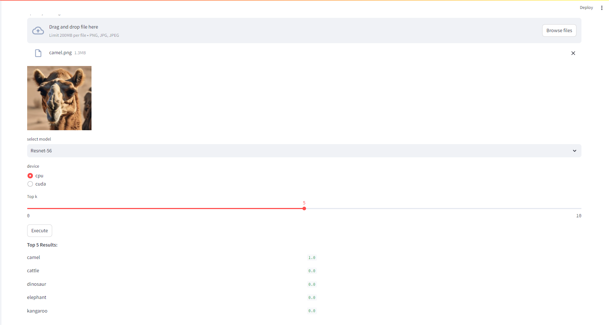

# image_classification

```
# start up
streamlit run Homepage.py
```

### predict interface

##### image classification



##### object detection


### Train interface


### Result display interface


